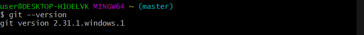
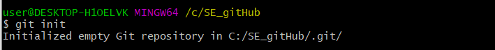
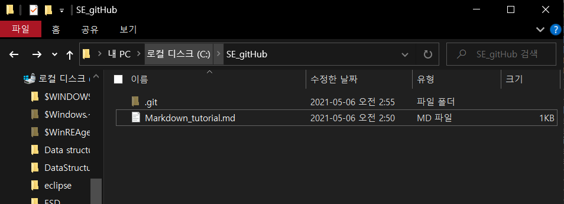

GitHub repository URL : <https://github.com/seyxxn/GitHubPractice>  

# git & GitHub Tutorial  

> ## **git** 은 **형상관리도구** (버전관리시스템)  
> ## **GitHub** 는 **원격 저장소** (원격 전송된 내역들이 저장되는 공간을 제공)  
    
## **(1) GitHub 사용 전 알아야 할 사전 지식**
----
**로컬 저장소** : 내 PC에 파일이 저장되는 개인 전용 저장소  
**원격 저장소** : 파일이 원격 저장소 전용 서버에서 관리되며 여러 사람이 함께 공유하기 위한 저장소  
**커밋 (commit)** : 파일을 추가하거나 변경한 내용을 저장소에 저장하는 작업  
**푸시 (push)** : 파일을 추가하거나 변경한 내용을 원격 저장소에 업로드하는 작업 (즉, 로컬저장소에 커밋한 파일들을 원격저장소에 추가하는 작업)  
**브랜치(branch)** : 하나의 프로젝트를 여러 갈래로 나누어 관리 가능하게 하는 기능, 최초 Git 초기화 시에는 기본적으로 **master** 브랜치가 생성   

  

<Git의 3가지 상태>  

Committed : 데이터가 로컬 저장소에 안전하게 저장  
Modified : 수정한 파일을 아직 로컬 저장소에 커밋하지 않음  
Staged : 현재 수정한 파일을 곧 커밋할 것임을 의미  

## **(2) Git 설치**
---
2.1 Git SCM 접속 후 운영체제에 맞는 설치 파일 다운로드  
Git SCM URL : <https://git-scm.com/>  

2.2 Git Bash에서 깃 버전 확인
> ### git --version  
  

2.3 Git 사용자 등록 및 확인  
- Git 설치 후에는 Git의 사용 환경을 적절하게 설정해 주어야 함  
**git config** 명령어로 설정 내용을 확인하고 변경할 수 있음   
> ### git config --global user.name "name"  
> ### git config --global user.email "emailAddress"  
 
- 프로젝트 마다 다른 설정을 하고 싶다면 --global 옵션을 제거  
-  --global 옵션을 넣는다면 이 컴퓨터에서 작업하는 모든 프로젝트에 공통으로 적용 

> ### git config --list  

  
- --list 옵션을 통해 사용자 확인 가능  

## **(3) Git 저장소 생성**
---
- Git 저장소를 사용하는 방법은 2가지 존재  
     3.1 아직 버전관리를 하지 않는 로컬 저장소를 Git 저장소로 사용  
     3.2 다른 어딘가에서 Git 저장소를 Clone하여 사용  

3.1.1 로컬저장소로 사용할 폴더 생성  

  
- SE_gitHub 폴더 생성  

3.1.2 해당 저장소로 위치 이동  
- 방법 1 ) **cd** (change directory) 명령어 사용  
> cd [로컬 저장소 경로]  

  
- 방법 2 ) 해당 로컬 저장소 폴더에서 마우스 우 클릭 후 Git Bash Here 실행  

  
  

3.1.3 Git 원격 저장소 생성  
- **git init**은 버전 관리를 하고 싶은 폴더에서 초기화를 하는 준비  
현재 디렉토리를 기준으로 Git 저장소가 생성됨  

> git init  

   

  

- .git 폴더 생성됨 (새로운 Git 저장소가 생성)  

----

3.2.1 복제할 원격 저장소 Clone 주소 복사  

3.2.2 git clone 명령어 사용  
- **git clone**으로 로컬 저장소에 GitHub에 있던 원격 저장소를 복사 할 수 있음  
> git clone [URL]  

## **(4) Git 명령어**
----
4.1 원격저장소 조작  
>  git remote add [remote repository의 이름] [원격 저장소 github URL]  

  

- 원격 저장소와 해당 로컬 저장소를 연결할 수 있음  

> git remote 

  
- 추가한 원격저장소의 이름 목록을 확인  

4.2  파일 추가하기  

  
- 로컬저장소에 Markdown_tutorial.md 문서 생성 후  
 **git add** 를 사용하여 파일 추가 가능
> git add [파일]  

> git add .
- . 을 넣으면 모든 파일을 한번에 추가 가능 

4.3 파일 상태 확인하기
- **git status** 는 현재 나의 로컬 폴더와 Git과의 상태를 싱크 상태를 체크
> git status  

- on branch master는 현재 작업중인 브랜치가 master 임을 의미  
(기본 branch : master)  

- 현재, 로컬 저장소에 파일을 추가하고 아직 커밋(뒤에서 다룰 예정)하지 않았기 때문에 No commits yet 상태  

- new file : Markdown_tutorial.md 추가 된 파일 나타냄  

< 파일 상태 >
>- 1. untracked 상태 : 추적되지 않고 있는 파일, 즉 파일을 생성한 후 한번도 add 하지 않은 상태  
>- 2. Tracked 상태 : 파일이 git에 의해 그 변동사항이 추적되는 상태  
>        - 2.1 Staged 상태 : 파일 수정 후에 Staging area에 올라가 있는 상태  
>        - 2.2 Unmodified 상태 : 현재 파일이 최신 커밋 파일과 비교하여 바뀐 것이 없는 상태  
>        - 2.3 Modified 상태 : 현재 파일이 커밋 파일과 비교하여 바뀐게 있는 상태  

4.4 변경사항 확정 하기
- **git commit**은 추가 된 파일이나 폴더의 내용을 저장소에 보낼 때 사용 (변경사항을 확정함)

> git commit -m "커밋 메세지"

- -m은 커밋메세지 옵션

> git commit -a 
- 별도의 add 명령어를 사용하지 않고 수정된 파일에 대해 add와 commit을 한번에 수행

> git commit -am "커밋 메세지"
- a와 m의 옵션을 합침  

- 커밋 한 후에 status 명령을 통해 상태 확인
- 더 이상 커밋할 것이 없음을 의미

4.5 커밋 히스토리 조회하기
- **git log**로 로컬저장소의 커밋 히스토리를 탐색  
> git log  

  

4.6 내 로컬저장소에서 원격저장소로 보내기  
- **git push** 를 사용하여 로컬저장소에 커밋한 파일들을 원격저장소에 추가  
> git push [원격 저장소 이름] [브랜치명]  

  

- push 하고 나면 github에서 커밋 내용을 볼 수 있음
- push 없이 커밋만 하면 현재의 변경 내용은 아직 로컬 저장소의 HEAD 안에 머물고 있음, 이 변경 내용을 원격 서버로 올리려면 **push**가 필요  

4.7 **브랜치(branch)** 사용

- 하나의 프로젝트를 여러 갈래로 나누어 관리 가능

- 각각의 독립된 브랜치에서 마음대로 소스코드를 변경하여 작업한 후 원래 버전과 비교하여 또 하나의 새로운 버전을 만들어 냄

4.7.1 branch 목록 보기

> git branch

- 현재 브랜치 목록을 살펴봄
- master 브랜치 (기본 브랜치) 가 존재하며, \*는 현재 활성화 된 브랜치

4.7.2 branch 생성 하기  
> git branch [브랜치명]  

  
- 브랜치 생성  

- 독립적인 공간을 생성함

- 새로 만든 firstBranch는 master와 완전히 동일한 상태를 가진 공간  

- 브랜치에서 수정을 한 후에 커밋하면 firstBranch 에만 기록되며 master 브랜치에는 어떤 영향도 주지 않음  

  

  

        * 새로 만든 브런치를 원격 저장소로 전송하기 전 까지는 다른 사람들이 접근할 수 없음
                git push origin [브랜치명] 을 통해 push해야함  
            
  

4.7.3 브랜치 이동 하기
> git checkout [브랜치명]  

  

- 독립된 작업 공간인 브랜치를 자유롭게 이동할 수 있음  

> git checkout -b [브랜치명]  
- 브랜치 생성 후 바로 이동  

4.7.4 브랜치 병합하기  
- 브랜치 병합 방법에는 2가지가 존재

1) **merge** 이용
> git merge [브랜치명]  
- secondBranch에 작성한 파일을 master 브랜치에 병합해보자.

- master 브랜치로 이동 후에 **merge** 사용

2) **rebase** 이용
> git rebase -i [브랜치명]  
- merge와 같은 역할  
- 다른 점은 rebase는 커밋을 하나로 정리하여 푸시하기 때문에 깔끔함  

4.8 원격저장소에서 내 로컬저장소로 보내기
- **git pull** 을 사용하여 원격저장소와 내 로컬저장소의 상태를 동일하게 만듦
- 다른 사람이 원격저장소에 업데이트 한 파일이 있다면, 가장 최신의 상태로 작업하기 위해서 pull을 반드시 사용

> git pull [원격저장소이름] [브랜치명]
- 원격저장소의 변경사항을 가져와서 로컬저장소의 브랜치에 합치는 작업
- 변경 내용이 로컬 작업 디렉토리에 받아지고, 병합됨 

- 원격저장소에서 commit 후 push 함

  
- 로컬저장소로 최신 변경 내용을 가져오기 위해 pull 사용

4.9 과거의 커밋으로 돌아가기  
> git reset [옵션] [커밋ID] 
- --hard : 변경 이력과 내용을 전부 삭제함  

  

- 수정 후 commit 함  

  

- log 살펴보면 이 전에 commit한 내용이 출력 됨

  

- reset --hard 를 통해 과거의 커밋으로 돌아감

- hard는 이 전 커밋을 삭제함  

4.10 태그(tag) 남기기
> git tag [태그이름] [커밋아이디]  

- 식별자는 git log 하면 알 수 있음
